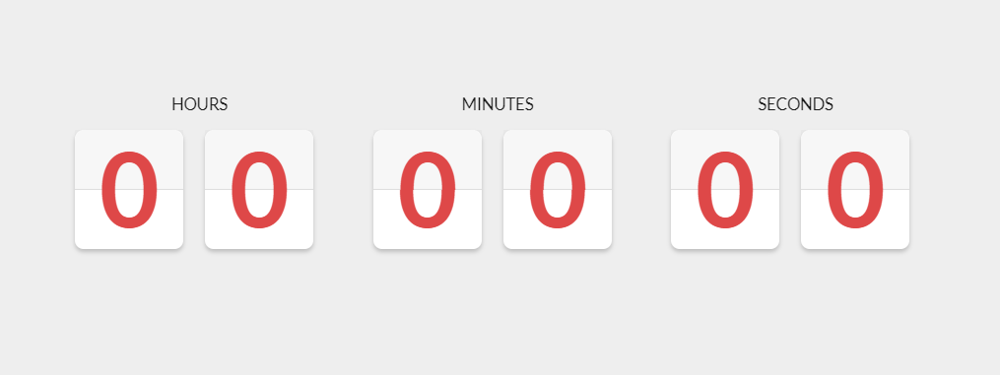

# React Timer Component

A [React](https://reactjs.org/) Timer component based on a jquery based 
[component](https://codepen.io/doriancami/pen/jEJvaV).
 
 Displays a timer on creation and updates every second.



## Installation 

Install through [npm](https://www.npmjs.com/get-npm) or [yarn](https://classic.yarnpkg.com/en/docs/getting-started).
```shell script
npm install timer-component
```
```shell script
yarn add timer-component
```

## Usage 
```js
import Timer from 'timer-component';
```

## Props

### seconds (required)
Use **seconds** to declare how many seconds the timer should count for.
Accepts any positive integer. 

```js
<Timer seconds={60}/>
```

### className (optional)
Use **className** to add a CSS class onto the component.

```js
<Timer className={"custom-class-name"}/>
```

### Pitfalls 
This component does not support time intervals larger than hours or smaller than
seconds (i.e. days or milliseconds).
### Development
There are some scripts available in package.json. 

- `yarn start` - to watch for file changes and update automatically with webpack
- `yarn build` - to build the package and store in ./dist/index.js 

I welcome any from of participation, so feel free to submit an 
[issue](https://github.com/alvinnguyen116/countdown-component/issues) or make a 
[pull request](https://github.com/alvinnguyen116/countdown-component/pulls). 
